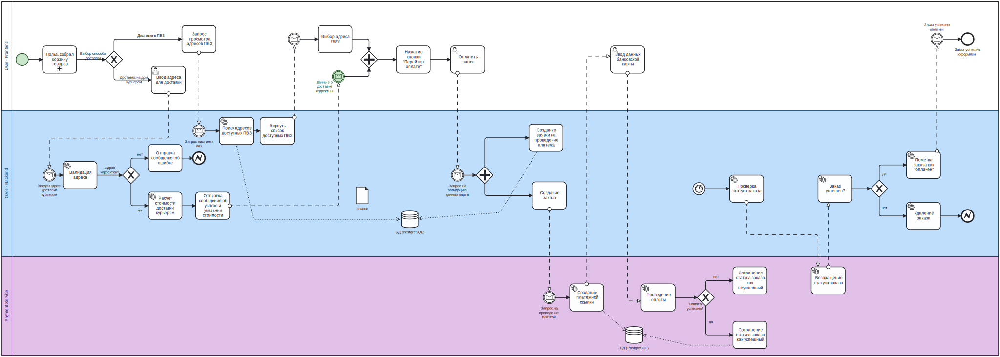
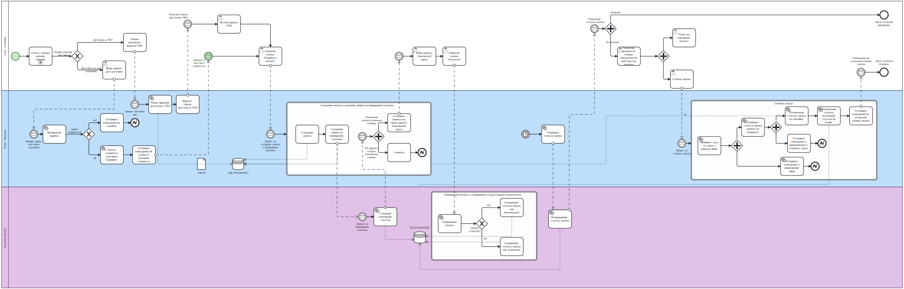

# БЛПС лабораторная работа 1

## Вариант: 2411

## Выполнили: Денисова Алёна, Пименова Екатерина (девочки-отличницы )

## Задание:

> OZON маркетплейс — миллионы товаров по выгодным ценам — https://www.ozon.ru. Бизнес-процесс: оформление доставки —
> бесплатной в пункт выдачи и платной на дом.

Описать бизнес-процесс в соответствии с нотацией BPMN 2.0, после чего реализовать его в виде приложения на базе Spring
Boot.

### Порядок выполнения работы:

1. Выбрать один из бизнес-процессов, реализуемых сайтом из варианта задания.
2. Утвердить выбранный бизнес-процесс у преподавателя.
3. Специфицировать модель реализуемого бизнес-процесса в соответствии с требованиями BPMN 2.0.
4. Разработать приложение на базе Spring Boot, реализующее описанный на предыдущем шаге бизнес-процесс. Приложение
   должно использовать СУБД PostgreSQL для хранения данных, для всех публичных интерфейсов должны быть разработаны REST
   API.
5. Разработать набор curl-скриптов, либо набор запросов для REST клиента Insomnia для тестирования публичных интерфейсов
   разработанного программного модуля. Запросы Insomnia оформить в виде файла экспорта.
6. Развернуть разработанное приложение на сервере helios.

# Swagger

Находится по ссылке http://localhost:8080/swagger-ui/index.html

# BPMN
## lab1

## lab2
